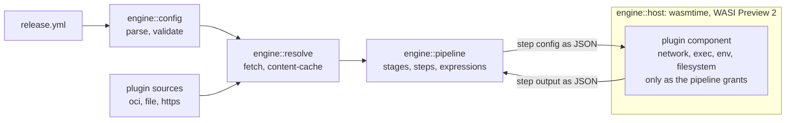

<div align="center">


# Moonlit

**Build and release automation powered by Rust and sandboxed WebAssembly plugins.**

Pipelines are declared in YAML and executed by a `wasmtime` host that runs every plugin
as an isolated WebAssembly component — with no ambient access to your network, filesystem,
environment, or subprocesses unless the pipeline grants it.

[](https://github.com/wolfware-labs/moonlit/actions/workflows/ci.yml)
[](https://codecov.io/gh/wolfware-labs/moonlit)
[](#license)

<table align="center">
<tr>
<td align="right"><b>Moonlit&nbsp;CLI</b></td>
<td>
<a href="https://github.com/wolfware-labs/moonlit/releases/latest"></a>
<a href="https://github.com/wolfware-labs/homebrew-tap"></a>
<a href="https://www.npmjs.com/package/@moonlitbuild/cli"></a>
<a href="https://community.chocolatey.org/packages/moonlit"></a>
<a href="https://hub.docker.com/r/wolfware/moonlit"></a>
</td>
</tr>
<tr>
<td align="right"><b>Moonlit&nbsp;PDK</b></td>
<td>
<a href="https://crates.io/crates/moonlit-pdk"></a>
<a href="https://crates.io/crates/moonlit-pdk-macros"></a>
<a href="https://docs.rs/moonlit-pdk"></a>
</td>
</tr>
</table>

</div>

## Why Moonlit

Most release tooling asks you to trust every plugin you install with the full authority of
the process that runs it. Moonlit inverts that. A plugin is a WebAssembly component with no
capabilities by default — each pipeline declares, per plugin, which hosts it may reach,
which programs it may execute, which environment variables it may read, and whether it may
touch the working directory at all.

- **Sandboxed by default.** Capabilities are granted in the pipeline file, not assumed.
- **Portable plugins.** Components are architecture-independent and cached by content.
- **One file to read.** The whole pipeline — plugins, permissions, stages, conditions —
  lives in a single YAML document.

## Installation

Shell one-liner, PowerShell, Homebrew, Chocolatey, npm, or Docker — see **[INSTALL.md](INSTALL.md)**.

```sh
brew install wolfware-labs/tap/moonlit
```

Or run it without installing anything:

```sh
docker run --rm -v "$PWD:/work" wolfware/moonlit:latest run
```

## Quick start

Write a `release.yml`:

```yaml
name: demo

plugins:
  - name: github
    url: oci://registry.moonlitbuild.dev/wolfware/github:2.0.0
    permissions:
      network: ["api.github.com"]   # hosts reachable via wasi:http
      exec: []                      # programs the plugin may spawn
      env: ["GITHUB_*"]             # env vars it may read
      filesystem: read-only         # none | read-only | read-write

stages:
  release:
    - name: publish
      run: github.create-release    # plugin alias . middleware name
      config:
        name: v1.2.3
        tag: v1.2.3
```

Then run it:

```sh
moonlit run              # execute the pipeline
moonlit validate         # resolve plugins and check middleware refs, without executing
```

A step may also carry `condition:` and `haltIf:` expressions and `continueOnError:`, and
each step's output is published under its name for later steps to read.

## Workspace

| Crate | Published as | What it does |
| --- | --- | --- |
| **`cli`** | [`moonlit`](https://github.com/wolfware-labs/moonlit/releases/latest) — GitHub, Homebrew, npm, Chocolatey | The `moonlit` binary: `run`, `validate`, `plugin` (scaffold/build/inspect/publish), `login`/`logout` for OCI registries, and `cache`. Renders pipeline execution live in the terminal, with a plain mode for CI. |
| **`engine`** | not published (internal library) | The runtime. Parses and validates pipeline YAML, evaluates the expression language, resolves plugins from `oci://`, `file://`, and `http(s)://`, instantiates them on `wasmtime` (WASI Preview 2), enforces the declared permissions, and drives stages and steps to completion. |
| **`pdk`** | [`moonlit-pdk`](https://crates.io/crates/moonlit-pdk) | The plugin development kit. Write a plugin as typed `Middleware` structs with JSON-Schema `Input`/`Output` types; the crate supplies the host bindings — HTTP, process, env, filesystem, clock, randomness, changelog and state helpers — plus test doubles for unit-testing a plugin off-host. |
| **`pdk-macros`** | [`moonlit-pdk-macros`](https://crates.io/crates/moonlit-pdk-macros) | The `moonlit_plugin!` procedural macro that turns those structs into an exported WebAssembly component. Pulled in automatically by `moonlit-pdk`. |

The CLI and engine share one version and ship together as the `moonlit` product. The two
plugin crates are versioned independently and published to crates.io, because plugin authors
depend on them directly.

## How it works



The plugin ABI is authored in WIT at `engine/wit/moonlit-plugin.wit`. Dynamic config and
step outputs cross that boundary as JSON, and are bridged to a typed value tree on the Rust
side, so a plugin never sees host memory or host handles it was not granted.

## Writing a plugin

```sh
moonlit plugin new my-plugin      # scaffold a crate wired to moonlit-pdk
moonlit plugin build --release    # compile to a WASI-P2 component
moonlit plugin inspect ./my.wasm  # print its metadata and middlewares
moonlit plugin publish oci://ghcr.io/acme/my-plugin:1.0.0
```

API reference for the plugin crate: **[docs.rs/moonlit-pdk](https://docs.rs/moonlit-pdk)**.

## Documentation

- [INSTALL.md](INSTALL.md) — every installation method
- [CONTRIBUTING.md](CONTRIBUTING.md) — development setup and workflow
- [SECURITY.md](SECURITY.md) — reporting a vulnerability
- [moonlitbuild.dev](https://moonlitbuild.dev/) — guides and reference

## Contributing

Issues and pull requests are welcome — start with [CONTRIBUTING.md](CONTRIBUTING.md).

## License

Moonlit is open source, dual-licensed under either of

- [Apache License 2.0](LICENSE-APACHE)
- [MIT license](LICENSE-MIT)

at your option. You may use, copy, modify, and distribute it freely, including in commercial
and closed-source products. See [NOTICE](NOTICE) for trademark terms.

A managed cloud service is planned at moonlitbuild.cloud.

## Trademarks

"Moonlit" and the Moonlit logo are trademarks of Wolfware LLC. See
[TRADEMARKS.md](TRADEMARKS.md) and [NOTICE](NOTICE).
