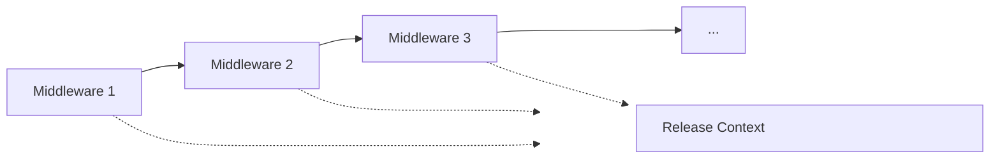

# Middleware Pipeline

Moonlit uses a middleware pipeline pattern to execute steps in a release pipeline. This page explains how the middleware pipeline works and how to create custom middlewares.

## What is a Middleware Pipeline?

A middleware pipeline is a series of components (middlewares) that process a request in sequence. Each middleware:

1. Receives a context object
2. Performs its specific task
3. Updates the context with its results
4. Passes the context to the next middleware in the pipeline

This pattern is commonly used in web frameworks like ASP.NET Core, but Moonlit adapts it for release pipeline automation.

## Middleware Pipeline in Moonlit

In Moonlit, the middleware pipeline is used to execute steps in a release pipeline:



Each middleware in the pipeline:

1. Receives the `ReleaseContext` object and configuration
2. Performs its specific task (e.g., building a project, creating a release)
3. Updates the context with its results (e.g., build output, release URL)
4. Returns a `MiddlewareResult` indicating success or failure

## Middleware Interface

All middlewares in Moonlit implement the `IReleaseMiddleware` interface:

```csharp
public interface IReleaseMiddleware
{
  Task<MiddlewareResult> ExecuteAsync(ReleaseContext context, IConfiguration configuration);
}
```

The `ExecuteAsync` method is called when the middleware is executed in the pipeline. It receives a `ReleaseContext` object and an `IConfiguration` object, and returns a `MiddlewareResult`.

Alternatively, you can inherit from the `ReleaseMiddleware<T>` abstract class, which provides a more convenient way to handle configuration:

```csharp
public abstract class ReleaseMiddleware<TConfiguration> : IReleaseMiddleware
{
  public Task<MiddlewareResult> ExecuteAsync(ReleaseContext context, IConfiguration configuration)
  {
    ArgumentNullException.ThrowIfNull(context, nameof(context));
    ArgumentNullException.ThrowIfNull(configuration, nameof(configuration));

    var config = configuration.GetRequired<TConfiguration>();
    return ExecuteAsync(context, config);
  }

  protected abstract Task<MiddlewareResult> ExecuteAsync(ReleaseContext context, TConfiguration configuration);
}
```

The abstract class handles the configuration deserialization for you, so you only need to implement the protected `ExecuteAsync` method that receives the strongly-typed configuration.

## Release Context

The `ReleaseContext` class is passed through the pipeline and contains information about the release process. According to the issue description, the `ReleaseContext` class looks like this:

```csharp
public sealed record ReleaseContext
{
  public CancellationToken CancellationToken { get; init; }

  public string WorkingDirectory { get; init; } = Environment.CurrentDirectory;
}
```

The `ReleaseContext` provides:

- `CancellationToken`: Used to check if the operation has been canceled
- `WorkingDirectory`: The directory where the release process is running (defaults to the current directory)

In addition to these properties, the context system in Moonlit also provides extension methods for:

- Getting configuration for the current step
- Getting output from previous steps
- Adding output for subsequent steps

### Working with Configuration

When implementing the `IReleaseMiddleware` interface directly, you receive the configuration as a parameter:

```csharp
public Task<MiddlewareResult> ExecuteAsync(ReleaseContext context, IConfiguration configuration)
{
    // Get configuration from the parameter
    var config = configuration.Get<MyMiddlewareConfig>();

    // Use the configuration
    var option = config.SomeOption;

    return Task.FromResult(MiddlewareResult.Success());
}
```

When inheriting from `ReleaseMiddleware<T>`, the configuration is automatically deserialized for you:

```csharp
public class MyMiddleware : ReleaseMiddleware<MyMiddlewareConfig>
{
    protected override Task<MiddlewareResult> ExecuteAsync(ReleaseContext context, MyMiddlewareConfig config)
    {
        // Use the configuration directly
        var option = config.SomeOption;

        return Task.FromResult(MiddlewareResult.Success());
    }
}
```

The configuration is automatically deserialized from the YAML configuration file to your strongly-typed configuration class.

### Getting Output from Previous Steps

You can get output from previous steps using the context's output system:

```csharp
public Task<MiddlewareResult> ExecuteAsync(ReleaseContext context, IConfiguration configuration)
{
    // Get output from a previous step
    var previousOutput = context.GetOutput<string>("previousStep", "outputName");

    // Use the output
    // ...

    return Task.FromResult(MiddlewareResult.Success());
}
```

Or when using the `ReleaseMiddleware<T>` abstract class:

```csharp
protected override Task<MiddlewareResult> ExecuteAsync(ReleaseContext context, MyMiddlewareConfig config)
{
    // Get output from a previous step
    var previousOutput = context.GetOutput<string>("previousStep", "outputName");

    // Use the output
    // ...

    return Task.FromResult(MiddlewareResult.Success());
}
```

The `GetOutput<T>` method takes two parameters:
- The name of the step that produced the output
- The name of the output property

### Adding Output for Subsequent Steps

You can add output for subsequent steps using the context's output system:

```csharp
public Task<MiddlewareResult> ExecuteAsync(ReleaseContext context, IConfiguration configuration)
{
    // Perform some operation
    var result = "Hello, World!";

    // Add output to context
    context.AddOutput("outputName", result);

    return Task.FromResult(MiddlewareResult.Success());
}
```

Or when using the `ReleaseMiddleware<T>` abstract class:

```csharp
protected override Task<MiddlewareResult> ExecuteAsync(ReleaseContext context, MyMiddlewareConfig config)
{
    // Perform some operation
    var result = "Hello, World!";

    // Add output to context
    context.AddOutput("outputName", result);

    return Task.FromResult(MiddlewareResult.Success());
}
```

The `AddOutput` method takes two parameters:
- The name of the output property
- The value of the output property

## Middleware Result

The `MiddlewareResult` class represents the result of a middleware execution and provides information about its success or failure, along with any output or warnings:

```csharp
public sealed record MiddlewareResult
{
  public bool IsSuccessful { get; init; }

  public string? ErrorMessage { get; init; }

  public MiddlewareOutput Output { get; init; } = new();

  public List<string> Warnings { get; init; } = [];

  public static MiddlewareResult Success(Action<MiddlewareOutput>? setOutput = null)
  {
    var result = new MiddlewareResult {IsSuccessful = true};
    setOutput?.Invoke(result.Output);
    return result;
  }

  public static MiddlewareResult Failure(string errorMessage) =>
    new() {IsSuccessful = false, ErrorMessage = errorMessage};

  public static MiddlewareResult Warning(string warning, Action<MiddlewareOutput>? setOutput = null)
  {
    var result = new MiddlewareResult {IsSuccessful = true, Warnings = [warning]};
    setOutput?.Invoke(result.Output);
    return result;
  }
}
```

The `MiddlewareResult` class has the following properties:

- `IsSuccessful`: Indicates whether the middleware execution was successful
- `ErrorMessage`: Contains an error message if the execution failed
- `Output`: Contains the output data produced by the middleware
- `Warnings`: Contains any warnings generated during execution

You can create a `MiddlewareResult` using the following static methods:

```csharp
// Return success without output
return MiddlewareResult.Success();

// Return success with output
return MiddlewareResult.Success(output => 
{
    output.Add("key", "value");
});

// Return failure with error message
return MiddlewareResult.Failure("Something went wrong");

// Return success with a warning
return MiddlewareResult.Warning("This is a warning");

// Return success with a warning and output
return MiddlewareResult.Warning("This is a warning", output => 
{
    output.Add("key", "value");
});
```

If a middleware returns a failure result, the pipeline execution stops by default, unless the step is configured to continue on error.

### Middleware Output

The `MiddlewareOutput` class is used to store output data from a middleware execution:

```csharp
public sealed class MiddlewareOutput
{
  private readonly Dictionary<string, object?> _data;

  public MiddlewareOutput(IReadOnlyDictionary<string, object?>? initialData = null)
  {
    this._data = new Dictionary<string, object?>(initialData ?? new Dictionary<string, object?>());
  }

  public void Add<T>(string key, T value)
  {
    ArgumentNullException.ThrowIfNull(key, nameof(key));

    if (this._data.ContainsKey(key))
    {
      throw new ArgumentException($"Key '{key}' already exists in the middleware output.",
        nameof(key));
    }

    if (value is string strValue)
    {
      this._data[key] = strValue;
      return;
    }

    this._data[key] = value;
  }

  public Dictionary<string, object?> ToDictionary(string scope)
  {
    return this._data.ToDictionary(
      kvp => $"output:{scope}:{kvp.Key}",
      kvp => kvp.Value
    );
  }
}
```

The `MiddlewareOutput` class provides methods to:

- Add output data with a key-value pair
- Convert the output data to a dictionary with a specific scope

## Creating a Custom Middleware

To create a custom middleware, follow these steps:

1. Create a configuration class (optional):

```csharp
public class MyMiddlewareConfig
{
    public string SomeOption { get; set; }
    public int AnotherOption { get; set; }
}
```

2. Create a middleware class that implements `IReleaseMiddleware` or inherits from `ReleaseMiddleware<T>`:

### Option 1: Implementing IReleaseMiddleware

```csharp
public class MyMiddleware : IReleaseMiddleware
{
    private readonly ILogger<MyMiddleware> _logger;
    private readonly IMyService _myService;

    public MyMiddleware(ILogger<MyMiddleware> logger, IMyService myService)
    {
        _logger = logger;
        _myService = myService;
    }

    public async Task<MiddlewareResult> ExecuteAsync(ReleaseContext context, IConfiguration configuration)
    {
        _logger.LogInformation("Executing MyMiddleware");

        // Get configuration
        var config = configuration.Get<MyMiddlewareConfig>();

        // Execute middleware logic
        var result = await _myService.DoSomethingAsync(config.SomeOption);

        // Return success with output
        return MiddlewareResult.Success(output =>
        {
            output.Add("result", result);
        });
    }
}
```

### Option 2: Inheriting from ReleaseMiddleware&lt;T&gt;

```csharp
public class MyMiddleware : ReleaseMiddleware<MyMiddlewareConfig>
{
    private readonly ILogger<MyMiddleware> _logger;
    private readonly IMyService _myService;

    public MyMiddleware(ILogger<MyMiddleware> logger, IMyService myService)
    {
        _logger = logger;
        _myService = myService;
    }

    protected override async Task<MiddlewareResult> ExecuteAsync(ReleaseContext context, MyMiddlewareConfig config)
    {
        _logger.LogInformation("Executing MyMiddleware");

        // Execute middleware logic
        var result = await _myService.DoSomethingAsync(config.SomeOption);

        // Return success with output
        return MiddlewareResult.Success(output =>
        {
            output.Add("result", result);
        });
    }
}
```


3. Register the middleware in your plugin's startup class:

```csharp
public sealed class MyPluginStartup : PluginStartup
{
  protected override void ConfigurePlugin(IServiceCollection services, IConfiguration configuration)
  {
    // Register services
    services.AddSingleton<IMyService, MyService>();
  }

  protected override void AddMiddlewares(IServiceCollection services)
  {
    // Register middlewares with names
    services.AddMiddleware<MyMiddleware>("my-middleware");
  }
}
```

4. Use the middleware in your pipeline:

```yaml
name: "Middleware Example"

plugins:
  - name: "myplugin"
    url: "nuget://MyCompany.Moonlit.Plugins.MyPlugin/1.0.0"

stages:
  mystage:
    - name: mystep
      run: myplugin.my-middleware
      config:
        someOption: "value"
        anotherOption: 42
```

## Plugin Startup

Plugins in Moonlit use a startup class to configure services and register middlewares. This section explains how to implement a plugin startup class.

### IPluginStartup Interface

All plugin startup classes implement the `IPluginStartup` interface:

```csharp
public interface IPluginStartup
{
  void Configure(IServiceCollection services, IConfiguration configuration);
}
```

The `Configure` method is called when the plugin is loaded. It receives an `IServiceCollection` object and an `IConfiguration` object, and is responsible for configuring the plugin's services and middlewares.

### PluginStartup Abstract Class

While you can implement the `IPluginStartup` interface directly, it's recommended to inherit from the `PluginStartup` abstract class, which provides a more structured way to configure your plugin:

```csharp
public abstract class PluginStartup : IPluginStartup
{
  public void Configure(IServiceCollection services, IConfiguration configuration)
  {
    ArgumentNullException.ThrowIfNull(services);
    ArgumentNullException.ThrowIfNull(configuration);

    this.ConfigurePlugin(services, configuration);
    this.AddMiddlewares(services);
  }

  protected virtual void ConfigurePlugin(IServiceCollection services, IConfiguration configuration) { }

  protected abstract void AddMiddlewares(IServiceCollection services);
}
```

The `PluginStartup` abstract class:

- Implements the `IPluginStartup` interface
- Provides a `Configure` method that calls two separate methods:
  - `ConfigurePlugin`: For configuring plugin-specific services
  - `AddMiddlewares`: For registering middlewares
- Makes `ConfigurePlugin` virtual (optional to override)
- Makes `AddMiddlewares` abstract (required to override)

### Implementing a Plugin Startup Class

To implement a plugin startup class, follow these steps:

1. Create a class that inherits from `PluginStartup`:

```csharp
public sealed class GitHubPluginStartup : PluginStartup
{
  protected override void ConfigurePlugin(IServiceCollection services, IConfiguration configuration)
  {
    services.Configure<GitHubConfiguration>(configuration);
    services.AddSingleton<IGitHubClient>(svc =>
    {
      var githubConfig = svc.GetRequiredService<IOptions<GitHubConfiguration>>().Value;
      if (string.IsNullOrWhiteSpace(githubConfig.Token))
      {
        throw new InvalidOperationException("GitHub token is not configured.");
      }

      return new GitHubClient(new ProductHeaderValue("Wolfware.Moonlit.Plugins.Github"))
      {
        Credentials = new Credentials(githubConfig.Token)
      };
    });
    services.AddSingleton<IGitHubContextProvider, GitHubContextFactory>();
  }

  protected override void AddMiddlewares(IServiceCollection services)
  {
    services.AddMiddleware<GetLatestTag>("latest-tag");
    services.AddMiddleware<GetItemsSinceCommit>("items-since-commit");
    services.AddMiddleware<CreateRelease>("create-release");
    services.AddMiddleware<WriteVariables>("write-variables");
  }
}
```

In this example:

- The `ConfigurePlugin` method configures GitHub-specific services:
  - Registers the configuration
  - Registers the GitHub client
  - Registers other services needed by the plugin
- The `AddMiddlewares` method registers the middlewares provided by the plugin:
  - Each middleware is registered with a unique name
  - The name is used to reference the middleware in the pipeline configuration

### Best Practices for Plugin Startup Classes

1. **Keep Configuration Focused**: Each plugin should have its own configuration class that represents its specific configuration needs.

2. **Use Dependency Injection**: Register services using the dependency injection container to make them available to your middlewares.

3. **Use Meaningful Names**: Give your middlewares meaningful names that describe their purpose.

4. **Document Your Plugin**: Document your plugin's purpose, configuration options, and available middlewares.

## Middleware Best Practices

### 1. Keep Middlewares Focused

Each middleware should have a single responsibility. If a middleware is doing too much, consider splitting it into multiple middlewares.

### 2. Use Dependency Injection

Use constructor injection to receive dependencies:

```csharp
public class MyMiddleware : IReleaseMiddleware
{
    private readonly ILogger<MyMiddleware> _logger;
    private readonly IMyService _myService;

    public MyMiddleware(ILogger<MyMiddleware> logger, IMyService myService)
    {
        _logger = logger;
        _myService = myService;
    }

    // ...
}
```

Or when inheriting from `ReleaseMiddleware<T>`:

```csharp
public class MyMiddleware : ReleaseMiddleware<MyMiddlewareConfig>
{
    private readonly ILogger<MyMiddleware> _logger;
    private readonly IMyService _myService;

    public MyMiddleware(ILogger<MyMiddleware> logger, IMyService myService)
    {
        _logger = logger;
        _myService = myService;
    }

    // ...
}
```

### 3. Handle Errors Gracefully

Provide clear error messages and handle exceptions properly:

```csharp
public async Task<MiddlewareResult> ExecuteAsync(ReleaseContext context, IConfiguration configuration)
{
    try
    {
        // Get configuration
        var config = configuration.Get<MyMiddlewareConfig>();

        // Validate configuration
        if (string.IsNullOrEmpty(config.SomeOption))
        {
            return MiddlewareResult.Failure("SomeOption is required");
        }

        // Execute middleware logic
        var result = await _myService.DoSomethingAsync(config.SomeOption);

        // Return success with output
        return MiddlewareResult.Success(output =>
        {
            output.Add("result", result);
        });
    }
    catch (Exception ex)
    {
        _logger.LogError(ex, "Error executing middleware");
        return MiddlewareResult.Failure(ex);
    }
}
```

Or when inheriting from `ReleaseMiddleware<T>`:

```csharp
protected override async Task<MiddlewareResult> ExecuteAsync(ReleaseContext context, MyMiddlewareConfig config)
{
    try
    {
        // Validate configuration
        if (string.IsNullOrEmpty(config.SomeOption))
        {
            return MiddlewareResult.Failure("SomeOption is required");
        }

        // Execute middleware logic
        var result = await _myService.DoSomethingAsync(config.SomeOption);

        // Return success with output
        return MiddlewareResult.Success(output =>
        {
            output.Add("result", result);
        });
    }
    catch (Exception ex)
    {
        _logger.LogError(ex, "Error executing middleware");
        return MiddlewareResult.Failure(ex);
    }
}
```

### 4. Add Detailed Logging

Add detailed logging to help diagnose issues:

```csharp
public async Task<MiddlewareResult> ExecuteAsync(ReleaseContext context, IConfiguration configuration)
{
    _logger.LogInformation("Starting execution of MyMiddleware");

    // Get configuration
    var config = configuration.Get<MyMiddlewareConfig>();
    _logger.LogDebug("Configuration: {@Config}", config);

    // Execute middleware logic
    _logger.LogInformation("Executing service operation");
    var result = await _myService.DoSomethingAsync(config.SomeOption);
    _logger.LogDebug("Service operation result: {Result}", result);

    _logger.LogInformation("MyMiddleware execution completed successfully");
    return MiddlewareResult.Success(output =>
    {
        output.Add("result", result);
    });
}
```

Or when inheriting from `ReleaseMiddleware<T>`:

```csharp
protected override async Task<MiddlewareResult> ExecuteAsync(ReleaseContext context, MyMiddlewareConfig config)
{
    _logger.LogInformation("Starting execution of MyMiddleware");

    // Log configuration
    _logger.LogDebug("Configuration: {@Config}", config);

    // Execute middleware logic
    _logger.LogInformation("Executing service operation");
    var result = await _myService.DoSomethingAsync(config.SomeOption);
    _logger.LogDebug("Service operation result: {Result}", result);

    _logger.LogInformation("MyMiddleware execution completed successfully");
    return MiddlewareResult.Success(output =>
    {
        output.Add("result", result);
    });
}
```

### 5. Document Your Middleware

Document your middleware's purpose, configuration options, and outputs:

```csharp
/// <summary>
/// A middleware that does something useful.
/// </summary>
public class MyMiddleware : IReleaseMiddleware
{
    // ...
}
```

Or when inheriting from `ReleaseMiddleware<T>`:

```csharp
/// <summary>
/// A middleware that does something useful.
/// </summary>
public class MyMiddleware : ReleaseMiddleware<MyMiddlewareConfig>
{
    // ...
}

/// <summary>
/// Configuration options for MyMiddleware.
/// </summary>
public class MyMiddlewareConfig
{
    /// <summary>
    /// Some option that does something.
    /// </summary>
    public string SomeOption { get; set; }

    /// <summary>
    /// Another option that does something else.
    /// </summary>
    public int AnotherOption { get; set; }
}
```

## Condition Evaluation

Moonlit uses the DynamicExpresso library to evaluate conditions in the pipeline. Conditions are used in two places:

1. The `condition` property (corresponds to `ExecuteOn` in the API) determines whether a step should be executed.
2. The `haltIf` property determines whether the pipeline should halt after a step completes.

### How Conditions Are Evaluated

Conditions are evaluated against the output from previous steps. The `Output` variable is available in expressions and provides access to the output from all previous steps.

For example, the condition `$(output:repo:branch) == 'main'` is evaluated as `Output["repo"]["branch"] == 'main'` using DynamicExpresso.

Here's how conditions are evaluated in the pipeline:

1. For the `condition` property, if the condition evaluates to true, the step is executed. If it evaluates to false, the step is skipped.
2. For the `haltIf` property, if the condition evaluates to true, the pipeline halts after the step completes. If it evaluates to false, the pipeline continues with the next step.

### Examples of Conditions

```yaml
# Execute a step only if the branch is 'main'
- name: deployToProduction
  run: deploy.azure
  condition: $(output:repo:branch) == 'main'
  config:
    environment: "production"

# Stop the pipeline if the version is a prerelease
- name: checkVersion
  run: version.check
  haltIf: $(output:checkVersion:isPrerelease) == true
  config:
    version: $(output:version:nextVersion)

# Complex condition with multiple checks
- name: push
  run: dotnet.push
  condition: $(args:skipPush) == false && ($(args:prerelease) == true || $(output:version:isPrerelease) == false)
  config:
    package: $(output:pack:packagePath)
    source: $(vars:nugetSource)
```

## Advanced Middleware Techniques

### Conditional Execution

You can make a middleware execute conditionally based on the pipeline context:

```csharp
public Task<MiddlewareResult> ExecuteAsync(ReleaseContext context, IConfiguration configuration)
{
    // Get configuration
    var config = configuration.Get<MyMiddlewareConfig>();

    // Get output from a previous step
    var branch = context.GetOutput<string>("repo", "branch");

    // Skip execution based on a condition
    if (branch != "main" && !config.RunOnAllBranches)
    {
        _logger.LogInformation("Skipping execution on branch {Branch}", branch);
        return Task.FromResult(MiddlewareResult.Success());
    }

    // Continue with normal execution
    // ...

    return Task.FromResult(MiddlewareResult.Success());
}
```

Or when inheriting from `ReleaseMiddleware<T>`:

```csharp
protected override Task<MiddlewareResult> ExecuteAsync(ReleaseContext context, MyMiddlewareConfig config)
{
    // Get output from a previous step
    var branch = context.GetOutput<string>("repo", "branch");

    // Skip execution based on a condition
    if (branch != "main" && !config.RunOnAllBranches)
    {
        _logger.LogInformation("Skipping execution on branch {Branch}", branch);
        return Task.FromResult(MiddlewareResult.Success());
    }

    // Continue with normal execution
    // ...

    return Task.FromResult(MiddlewareResult.Success());
}
```

### Middleware Composition

You can compose multiple middlewares to create more complex behaviors:

```csharp
public class CompositeMiddleware : IReleaseMiddleware
{
    private readonly IReleaseMiddleware _firstMiddleware;
    private readonly IReleaseMiddleware _secondMiddleware;

    public CompositeMiddleware(IReleaseMiddleware firstMiddleware, IReleaseMiddleware secondMiddleware)
    {
        _firstMiddleware = firstMiddleware;
        _secondMiddleware = secondMiddleware;
    }

    public async Task<MiddlewareResult> ExecuteAsync(ReleaseContext context, IConfiguration configuration)
    {
        // Execute the first middleware
        var firstResult = await _firstMiddleware.ExecuteAsync(context, configuration);
        if (!firstResult.IsSuccess)
        {
            return firstResult;
        }

        // Execute the second middleware
        return await _secondMiddleware.ExecuteAsync(context, configuration);
    }
}
```

## Next Steps

- Learn about [dependency injection](./dependency-injection.md) in Moonlit
- See how to [create custom plugins](./custom-plugins.md) that provide middlewares
- Explore the [configuration system](../concepts/configuration.md) to understand how to configure middlewares
