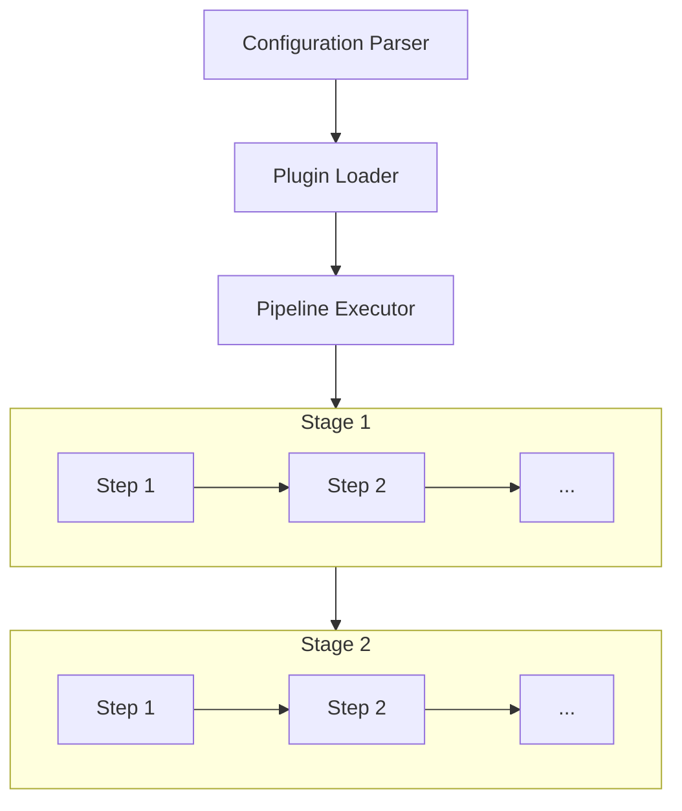

# How Moonlit Works

This page explains the architecture and core concepts of Moonlit, helping you understand how the tool processes your configuration and executes your pipeline.

## Architecture Overview

Moonlit follows a plugin-based architecture with a middleware pipeline pattern. Here's a high-level overview of how Moonlit works:

## Core Components

### Configuration Parser

The Configuration Parser reads your YAML file and converts it into a structured object model that Moonlit can process. It handles:

- Validating the YAML structure
- Resolving environment variables
- Parsing plugin configurations
- Organizing stages and steps

### Plugin Loader

The Plugin Loader is responsible for:

- Downloading and loading plugins from NuGet
- Initializing plugin startup classes
- Registering middleware components
- Setting up dependency injection

Each plugin must implement the `IPluginStartup` interface or inherit from the `PluginStartup` class to be properly loaded.

### Pipeline Executor

The Pipeline Executor manages the execution of your pipeline:

- It organizes steps into stages
- It executes stages in the order defined in your configuration
- It passes the shared context between steps
- It handles errors and provides logging

### Middleware Pipeline

Each step in your pipeline is a middleware that:

- Receives the pipeline context
- Performs its specific action
- Updates the context with its results
- Passes the context to the next middleware

This pattern allows for a flexible and extensible pipeline where each step can build upon the results of previous steps.

## Execution Flow

When you run the `moonlit release` command, the following detailed sequence occurs:

1. **Configuration Parsing**:
   - The release command uses the release configuration parser to parse the YAML file into a `ReleaseConfiguration` instance
   - If specific stages were specified in the command arguments, the configuration is filtered to include only those stages
   - If command-line arguments were provided, they override any matching arguments defined in the configuration file

2. **Release Pipeline Creation**:
   - A new release pipeline is created using the `ReleasePipelineFactory`
   - The factory creates a new .NET configuration instance using `ConfigurationBuilder` with the following sources (in order of precedence):
     - Environment variables with the prefix "MOONLIT_"
     - Environment variables from .env file
     - Arguments and variables from the configuration file (accessible via "args:<arg_name>" and "vars:<variable_name>")

3. **Plugin Loading**:
   - The plugins specified in the configuration are loaded in parallel
   - For each plugin:
     - The plugin assembly is loaded
     - An instance of the plugin startup class is created
     - A new `ServiceCollection` is created (each plugin has its own DI scope)
     - A new configuration is created, combining the release configuration with the plugin-specific configuration
     - The plugin's `Configure` method is called with the service collection and configuration
     - A service provider is created from the service collection
     - A new instance of the plugin is created with the service provider

4. **Pipeline Execution**:
   - The release pipeline executes all middlewares in the order specified in the configuration
   - Each middleware receives the context from the previous middleware and updates it with its results
   - The pipeline handles errors and provides logging throughout the execution

## Context Sharing

One of the key features of Moonlit is the ability to share data between steps. This is done through:

1. **Output Variables**: Each step can produce output variables that can be referenced by later steps
2. **Configuration System**: Moonlit's configuration system allows for dynamic values using the `$(output:step:property)` syntax
3. **Dependency Injection**: Moonlit uses .NET's dependency injection system to share services between steps

## Error Handling

Moonlit includes robust error handling:

- If a step fails, the pipeline execution stops by default
- Errors are logged with detailed information
- You can configure steps to continue on error if needed

## Next Steps

- Learn about the [Plugins System](./plugins.md)
- Understand [Stages and Steps](./stages-steps.md) in more detail
- Explore the [Configuration](./configuration.md) options
