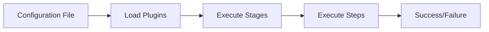

# Introduction to Moonlit

Moonlit is a powerful build and release automation tool. It provides a flexible, plugin-based architecture that allows you to define and automate complex release pipelines for various project types with a simple YAML configuration file.

## What is Moonlit?

Moonlit is a CLI tool that helps you automate your build and release processes for various technologies and project types. It can work with many different technologies including Docker, NPM, and more. It's designed to be:

- **Extensible**: Add functionality through plugins distributed as NuGet packages
- **Configurable**: Define your entire pipeline in a single YAML file
- **Flexible**: Run specific stages or the entire pipeline
- **Powerful**: Leverage dependency injection and middleware patterns

At its core, Moonlit reads a YAML configuration file that defines:

1. **Plugins**: External packages that provide functionality to your pipeline
2. **Stages**: Logical groupings of steps in your release process
3. **Steps**: Individual actions executed by middlewares in a specific order

## Key Components

### moonlit-cli

The main command-line interface for Moonlit, available as a NuGet package. It provides commands to:

- Run the entire pipeline or specific stages
- Specify the configuration file path
- Set the working directory

### Wolfware.Moonlit.Plugins

The foundational package for creating plugins. If you want to extend Moonlit with custom functionality, you'll reference this package in your plugin project.

### Official Plugins

Moonlit comes with several official plugins:

- **Wolfware.Plugins.Git**: Git repository operations
- **Wolfware.Plugins.GitHub**: GitHub API integration
- **Wolfware.Plugins.SemanticRelease**: Semantic versioning and changelog generation
- **Wolfware.Plugins.Slack**: Slack notifications
- **Wolfware.Plugins.Nuget**: NuGet package operations
- **Wolfware.Plugins.Docker**: Docker image building and publishing
- **Wolfware.Plugins.Npm**: NPM package operations

## How Moonlit Works

1. You define a YAML configuration file that specifies the plugins to use and the stages/steps of your pipeline
2. Moonlit loads the specified plugins from NuGet
3. Moonlit executes the stages and steps in the order defined in your configuration
4. Each step is a middleware that can access and modify the shared pipeline context
5. Data can be passed between steps using the configuration system

Here's a simplified view of how Moonlit processes your configuration:

## Next Steps

- [Installation Guide](./installation.md): Install Moonlit and get ready to use it
- [Quick Start](./quick-start.md): Create your first Moonlit pipeline
- [Core Concepts](./concepts/how-it-works.md): Dive deeper into how Moonlit works
